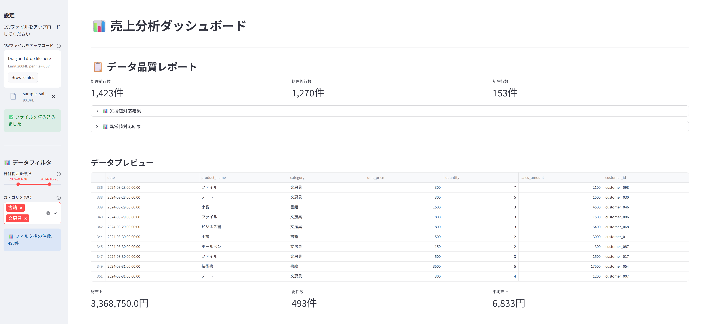
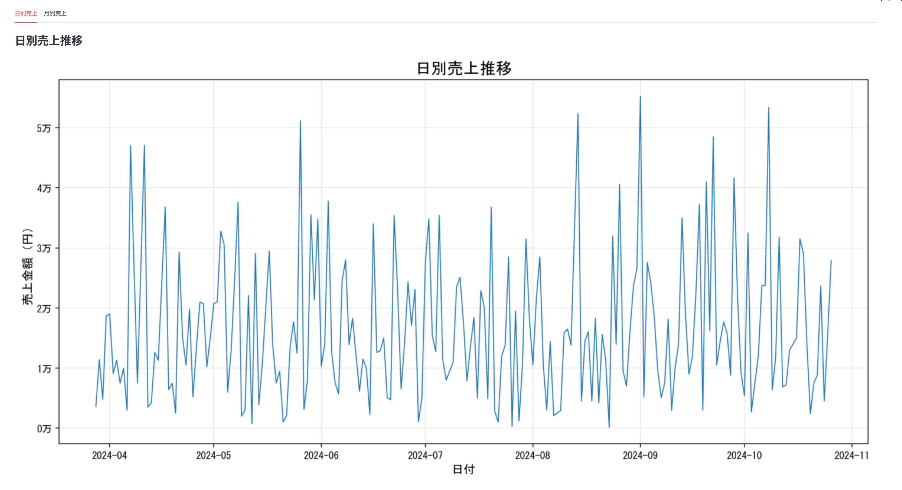
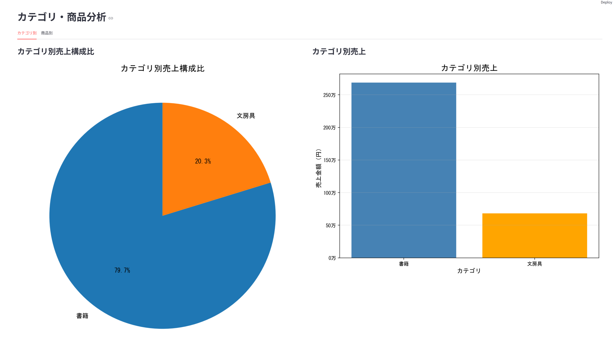
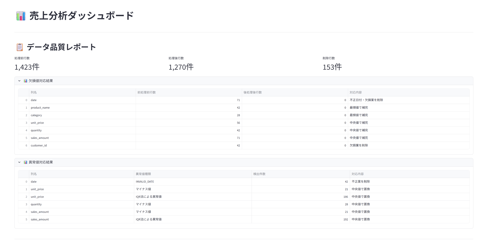

# 売上分析ダッシュボード

データ分析・可視化のためのインタラクティブダッシュボード

## プロジェクト概要

売上データをアップロードして、様々な角度から分析できるWebアプリケーションです。
データ前処理機能を搭載し、欠損値や異常値を自動処理したうえで、インタラクティブなグラフで可視化します。

### 想定ユーザー
- データアナリスト
- 営業マネージャー
- 経営企画担当者
- データ分析の学習者

---

## 主な機能

### 1. データアップロード・前処理
- CSVファイルのアップロード
- 欠損値の自動検出・補完
- 異常値の自動検出・補正（IQR法）
- データ品質レポートの生成

### 2. インタラクティブフィルタ
- 日付範囲選択
- カテゴリ選択（複数選択可）
- リアルタイムグラフ更新

### 3. 可視化・分析
- 日別・月別売上推移
- カテゴリ別売上分析（円グラフ・棒グラフ）
- 商品別売上ランキング
- 基本統計量（総売上・件数・平均）

---

## 技術スタック

- **言語**: Python 3.12
- **フレームワーク**: Streamlit
- **データ処理**: pandas, numpy
- **可視化**: matplotlib

---

## ファイル構成
'''
sales-dashboard/
├── app.py                          # メインアプリケーション
├── sample_sales_data.csv           # サンプルデータ
├── sample_sales_data_noisy.csv     # テスト用ノイズ入りデータ
├── requirements.txt                # 依存ライブラリ
└── README.md                       # このファイル
'''

---

## 使い方

### 1. アプリケーションの起動
'''bash
# プロジェクトディレクトリに移動
cd sales-dashboard

# 仮想環境を有効化
venv\Scripts\activate  # Windows
source venv/bin/activate  # Max/Linux →非対応

# アプリケーションを起動
streamlit run app.py
'''

ブラウザが自動で開き、ダッシュボードが表示されます。

---

### 2. データのアップロード

サイドバーの「CSVファイルをアップロード」からファイルを選択します。
アップロードしない場合は、サンプルデータが自動で読み込まれます。

**必須列**
- 'date': 日付（YYYY-MM-DD形式）
- 'sales_amount': 売上金額

---

### 3. フィルタの使用

サイドバーの「データフィルタ」で以下を設定：
- **日付範囲**: 開始時～終了日を選択
- **カテゴリ**: 表示したいカテゴリを選択（複数可）

フィルタを変更すると、グラフとメトリクスがリアルタイムで更新されます。

---

### 4. データ品質レポート

アップロード後、自動的にデータ品質レポートが表示されます、
- 処理前後の行数
- 欠損値対応結果
- 異常値対応結果

---

## データ前処理の詳細

### 欠損値対応

| 列 | 対応方法 |
|:--|:--|
| date | 行削除 |
| product_name | 最頻値で補完 |
| category | 最頻値で補完 |
| unit_price | 中央値で補完 |
| quantity | 中央値で補完 |
| sales_amount | 中央値で補完 |
| customer_id | 行削除 |

### 異常値対応

| 列 | 異常値種類 | 対応方法 |
|:--|:--|:--|
| date | INVALID_DATE | 行削除 |
| unit_price | マイナス値 | 中央値で置換 |
| unit_price | IQR法による異常値 | 中央値で置換 |
| quantity | マイナス値 | 中央値で置換 |
| sales_amount | マイナス値 | 中央値で置換 |
| sales_amount | IQR法による異常値 | 中央値で置換 |

**IQR法**: 四分位範囲で外れ値検出
- 上限 = Q3 + 1.5 * IQR
- 下限 = Q1 - 1.5 * IQR

---

## スクリーンショット

### フィルタ機能

### 日別売上推移

### カテゴリ別分析

### データ品質レポート

---

## 今後の拡張案

- [ ] より高度な統計分析(相関分析・トレンド分析)
- [ ] Excel形式(.xlsx)のサポート
- [ ] グラフのPDF/画像エクスポート
- [ ] ダッシュボードのカスタマイズ機能
- [ ] 複数CSVの比較機能
- [ ] 予測分析機能(機械学習)

---

## ライセンス

MIT License

---

## 作成者

t.ozawa.free

---

**作成日**: 2025年1月26日  
**最終更新**: 2025年2月4日